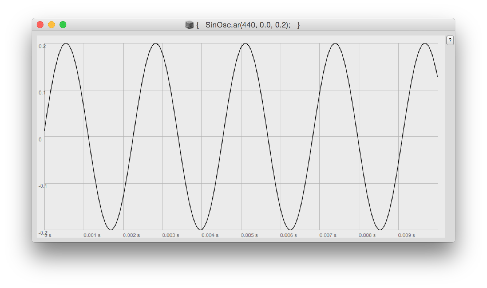
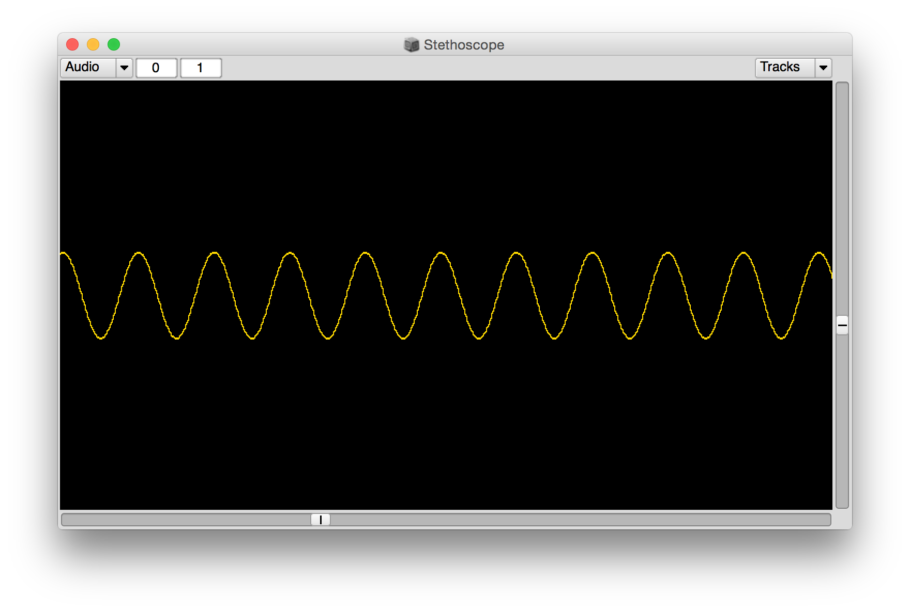

# Supercollider

Note: anything in between carrots (`<` to `>`) denotes user input or user key commands.

*Quick reference links*

[Supercollider](https://supercollider.github.io/), this is the main SC page these days.

[Docs](http://doc.sccode.org/), the docs will be installed on your machine with the application, but they can be accessed here as well.

[The SC Book](http://www.supercolliderbook.net/), the best book on SC (this website contains all of the code from the book, btw).

[SCCode](http://sccode.org/), a web-platform for sharing and remixing supercollider code.

[SCTweets](http://sctweets.tumblr.com/), supercollider code in 140 characters or less (frequently amazing).

[SC Mailing List](http://www.birmingham.ac.uk/facilities/ea-studios/research/supercollider/mailinglist.aspx), this is the main place to go for support other than the docs. All of the devs are very active on this list and respond quickly to questions.

## Download
Go [here](https://supercollider.github.io/download.html) to download SuperCollider. Once your download is complete, go ahead and install install.

## About
Supercollider is made up of two applications: a language interpreter and one or more synthesis servers. All communication between the `lang` (short for language) and the `server` is done via [OpenSoundControl](http://opensoundcontrol.org/).

## Starting the server
In order to make sound the server must be running. Type the following into a new window (`<Command+N>` makes a new window) and then hit `<Shift + Enter>` on the same line to execute the code:

```supercollider
s.boot;
```

Here `s` refers to the `localhost` server on your CPU.

`s.boot;` generally results in something like this in the post window:

```supercollider
Welcome to SuperCollider 3.6.6. For help type cmd-d.
localhost
Found 0 LADSPA plugins
Number of Devices: 16
   0 : "AirPlay"
   1 : "Built-in Microph"
   2 : "Built-in Output"
   3 : "After Effects 10.5"
   4 : "After Effects 11.0"
   5 : "After Effects 11.0.1"
   6 : "After Effects 11.0.2"
   7 : "After Effects 12.0"
   8 : "After Effects 12.2"
   9 : "After Effects 13.0"
   10 : "Prelude 1.0"
   11 : "Prelude 2.0"
   12 : "Premiere Pro 5.5"
   13 : "Premiere Pro 6.0"
   14 : "Premiere Pro 7.0"
   15 : "Premiere Pro 8.0"

"Built-in Microph" Input Device
   Streams: 1
      0  channels 2

"Built-in Output" Output Device
   Streams: 1
      0  channels 2

SC_AudioDriver: sample rate = 44100.000000, driver's block size = 512
SuperCollider 3 server ready.
Receiving notification messages from server localhost
Shared memory server interface initialized
```

One can quit the server by executing the following code:

```supercollider
s.quit;
```

## Functions
Similar to most other programming language, Functions in SC are denoted by the use of curly brackets. Anything between `{ }` is a function.

*For Example*

```supercollider
f = { "hello world!".postln; }
f.value;
```

The first line of code stores the function at `f`, whereas the second line returns the `value` (in this case, prints the message "hellow world!" to the post window) associated with the function.

## Arguments and Variables within Functions
Arguments allow one to pass values to a function when the function is called.

*For Example*

```supercollider
(
f = { arg a, b;
    a - b;
};
f.value(5, 3);
)
```

In the above code, evaluating the `f.value(5, 3)` results in the number `2` at the post.

And, of course, one can also use variables in functions.

*For Example*

```supercollider
(
f = { arg a, b;
    var firstResult, finalResult;
    firstResult = a + b;
    finalResult = firstResult * 2;
    finalResult;
};
f.value(2, 3);    // this will return (2 + 3) * 2 = 10
)
```

## Making Sound
Functions are used to make sound in SC. Execute the line below and, when you want it to stop, just type `<Command + .>`.

```supercollider
{ SinOsc.ar(440, 0, 0.2) }.play;
```

The code above plays a [Sine Wave](https://en.wikipedia.org/wiki/Sine_wave) with a frequency of 440Hz and an amplitude of 0.2 (amplitude, or what one can think of as volume, is generally kept within the range 0.0 to 1.0 in SC).

SC allows one to plot sounds like this onto a graph with `.plot`. This is useful if your sound is less deterministic than the above or if you need to check why something you are trying to do is inaudible or whatever.

*For Example*
```supercollider
{ SinOsc.ar(440, 0, 0.2) }.plot;
```

Which will result in this:


SC also has an oscilloscope method (`.scope`) which will display the changing waveform while playing it:

*For Example*
```supercollider
{ SinOsc.ar(440, 0, 0.2);
    LFTri.ar( 440, 0, 0.2 ); }.scope;
```

Which will result in this:


While `.plot` plots the function over time, and `.scope` shows a real-time plot of the waveform, both of those methods are generally used for testing and not for performance or recording.

## .play

Though it is generally used to listen to a function while it is playing, `.play` simply tells the server to start a process. The result of that process starting depends on the function, but generally `.play` will allow one to monitor (i.e. hear) whatever `UGens` or `SynthDefs` are inside of it.

```supercollider
{ SinOsc.ar(440, 0, 0.2) }.play;
```

The opposit of `.play` is `.stop`, however one would need to store an instance of the function in a variable in order to be able to use `.stop`. Similarly, `{ ... }` returns a function, whereas `{ ... }.play` returns a `Synth` object. `Synth` objects do not have a `.stop` method, so one must either `.free` or `.release` them in order to stop the sound.

*For Example*
```supercollider
x = { SinOsc.ar(440, 0, 0.2) };
x.play;
//lets give this a moment
x.stop;
```

## Ugens

## External Control

```supercollider
{ SinOsc.ar(MouseY.kr( 50, 2000), 0.0, MouseX.kr( 0.0,1.0 )); }.scope;
```

blah blah blah
